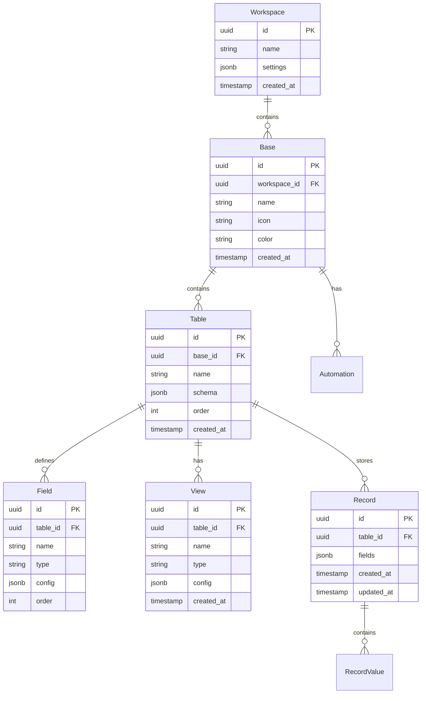

# KhaosBase - Sovereign Airtable Replacement

## Overview

KhaosBase is a self-hosted, zero-dependency alternative to Airtable that provides spreadsheet-like database management with multiple view types, real-time collaboration, and a powerful API.

**Status**: 🟡 In Development  
**Target Release**: Q4 2025  
**Feature Parity**: 0% → 97% (target)

---

## Architecture

```
┌─────────────────────────────────────────────────────────────┐
│                      KHAOSBASE                              │
├─────────────────────────────────────────────────────────────┤
│                                                             │
│  Frontend (React + Tailwind)                                │
│  ├── Grid View (spreadsheet-like)                          │
│  ├── Kanban View                                            │
│  ├── Calendar View                                          │
│  ├── Gallery View                                           │
│  ├── Form Builder                                           │
│  └── API Console                                            │
│                                                             │
│  Backend (Node.js + Hono)                                   │
│  ├── REST API                                               │
│  ├── WebSocket (real-time sync)                            │
│  ├── GraphQL (optional)                                     │
│  └── Webhook dispatcher                                     │
│                                                             │
│  Database (PostgreSQL)                                      │
│  ├── Dynamic schema (JSONB)                                │
│  ├── Full-text search                                       │
│  ├── Row-level security                                     │
│  └── Audit logging                                          │
│                                                             │
│  Extensions                                                 │
│  ├── Automations (trigger → action)                        │
│  ├── Scripting (JavaScript)                                │
│  ├── AI Fields (LLM integration)                           │
│  └── Import/Export (Airtable, CSV, JSON)                   │
│                                                             │
└─────────────────────────────────────────────────────────────┘
```

---

## Core Features

### 1. Multiple View Types

#### Grid View (Spreadsheet)
- Inline cell editing
- Drag-and-drop row reordering
- Column resizing and hiding
- Filtering and sorting
- Grouping by fields

#### Kanban View
- Drag-and-drop cards between columns
- Group by single-select or status fields
- Customizable card templates
- Swim lanes

#### Calendar View
- Day, week, month views
- Drag to reschedule
- Multiple date field support
- Event color coding

#### Gallery View
- Image-first display
- Customizable card layouts
- Pagination
- Lightbox for full-size images

#### Form View
- Public form links
- Custom branding
- Conditional logic
- File uploads
- Email notifications

### 2. Field Types

- **Text**: Single line, multi-line, rich text
- **Number**: Integer, decimal, currency, percentage
- **Date**: Date, datetime, duration
- **Select**: Single-select, multi-select
- **Attachment**: Files, images
- **Checkbox**: Boolean
- **Link**: URL, email
- **Formula**: Calculated fields
- **Rollup**: Aggregate linked records
- **Lookup**: Reference linked record fields
- **AI**: LLM-generated content

### 3. Collaboration

- Real-time cursors
- Presence indicators
- Comments on records
- @mentions
- Activity feed
- Change history

### 4. Automation

```yaml
automation_example:
  name: "New Customer Notification"
  trigger:
    type: record_created
    table: customers
  
  conditions:
    - field: status
      operator: equals
      value: new
  
  actions:
    - type: send_email
      to: sales@example.com
      subject: "New customer: {{name}}"
      body: "Customer {{name}} signed up!"
    
    - type: create_record
      table: tasks
      fields:
        title: "Onboard {{name}}"
        assigned_to: "{{account_manager}}"
```

### 5. API

```typescript
// REST API Examples

// List records
GET /api/v1/bases/:baseId/tables/:tableId/records
Query: ?filter={"status": "active"}&sort=createdAt&limit=100

// Create record
POST /api/v1/bases/:baseId/tables/:tableId/records
Body: { "fields": { "name": "Acme Inc", "status": "active" } }

// Update record
PATCH /api/v1/bases/:baseId/tables/:tableId/records/:recordId
Body: { "fields": { "status": "inactive" } }

// Delete record
DELETE /api/v1/bases/:baseId/tables/:tableId/records/:recordId

// Bulk operations
POST /api/v1/bases/:baseId/tables/:tableId/records/bulk
Body: { "operations": [...] }
```

---

## Technology Stack

### Frontend
- **Framework**: React 18 with TypeScript
- **Styling**: Tailwind CSS 3
- **State**: Zustand
- **Grid**: AG Grid Community (MIT)
- **Forms**: React Hook Form + Zod
- **Build**: Vite

### Backend
- **Runtime**: Bun (Node.js compatible)
- **Framework**: Hono
- **Validation**: Zod
- **ORM**: Drizzle ORM
- **WebSocket**: uWebSockets.js
- **Queue**: BullMQ + Redis

### Database
- **Primary**: PostgreSQL 15+
- **Cache**: Redis 7
- **Search**: Meilisearch
- **Extensions**: pgvector, pg_trgm, uuid-ossp

### Infrastructure
- **Container**: Docker
- **Orchestration**: Kubernetes (Helm)
- **Reverse Proxy**: Traefik
- **Storage**: MinIO (S3-compatible)

---

## Data Model

### Entity Relationship Diagram



### Database Schema

```sql
-- Workspaces
CREATE TABLE workspaces (
    id UUID PRIMARY KEY DEFAULT uuid_generate_v4(),
    name VARCHAR(255) NOT NULL,
    settings JSONB DEFAULT '{}',
    created_at TIMESTAMP DEFAULT NOW(),
    updated_at TIMESTAMP DEFAULT NOW()
);

-- Bases
CREATE TABLE bases (
    id UUID PRIMARY KEY DEFAULT uuid_generate_v4(),
    workspace_id UUID REFERENCES workspaces(id) ON DELETE CASCADE,
    name VARCHAR(255) NOT NULL,
    icon VARCHAR(50),
    color VARCHAR(50),
    created_at TIMESTAMP DEFAULT NOW(),
    updated_at TIMESTAMP DEFAULT NOW()
);

-- Tables
CREATE TABLE tables (
    id UUID PRIMARY KEY DEFAULT uuid_generate_v4(),
    base_id UUID REFERENCES bases(id) ON DELETE CASCADE,
    name VARCHAR(255) NOT NULL,
    description TEXT,
    order_index INT DEFAULT 0,
    created_at TIMESTAMP DEFAULT NOW(),
    updated_at TIMESTAMP DEFAULT NOW()
);

-- Fields
CREATE TABLE fields (
    id UUID PRIMARY KEY DEFAULT uuid_generate_v4(),
    table_id UUID REFERENCES tables(id) ON DELETE CASCADE,
    name VARCHAR(255) NOT NULL,
    type VARCHAR(50) NOT NULL,
    config JSONB DEFAULT '{}',
    order_index INT DEFAULT 0,
    created_at TIMESTAMP DEFAULT NOW(),
    updated_at TIMESTAMP DEFAULT NOW()
);

-- Records (EAV-style for flexibility)
CREATE TABLE records (
    id UUID PRIMARY KEY DEFAULT uuid_generate_v4(),
    table_id UUID REFERENCES tables(id) ON DELETE CASCADE,
    fields JSONB NOT NULL DEFAULT '{}',
    created_at TIMESTAMP DEFAULT NOW(),
    updated_at TIMESTAMP DEFAULT NOW()
);

-- Views
CREATE TABLE views (
    id UUID PRIMARY KEY DEFAULT uuid_generate_v4(),
    table_id UUID REFERENCES tables(id) ON DELETE CASCADE,
    name VARCHAR(255) NOT NULL,
    type VARCHAR(50) NOT NULL,
    config JSONB DEFAULT '{}',
    created_at TIMESTAMP DEFAULT NOW(),
    updated_at TIMESTAMP DEFAULT NOW()
);

-- Automations
CREATE TABLE automations (
    id UUID PRIMARY KEY DEFAULT uuid_generate_v4(),
    base_id UUID REFERENCES bases(id) ON DELETE CASCADE,
    name VARCHAR(255) NOT NULL,
    trigger JSONB NOT NULL,
    conditions JSONB DEFAULT '[]',
    actions JSONB NOT NULL,
    enabled BOOLEAN DEFAULT true,
    created_at TIMESTAMP DEFAULT NOW(),
    updated_at TIMESTAMP DEFAULT NOW()
);

-- Indexes
CREATE INDEX idx_records_table_id ON records(table_id);
CREATE INDEX idx_records_fields ON records USING GIN (fields);
CREATE INDEX idx_fields_table_id ON fields(table_id);
CREATE INDEX idx_views_table_id ON views(table_id);
```

---

## Airtable Migration Path

### 1. Export from Airtable

```bash
# Using Airtable API
curl "https://api.airtable.com/v0/${BASE_ID}/${TABLE_NAME}" \
  -H "Authorization: Bearer ${AIRTABLE_API_KEY}" \
  > airtable_export.json

# OR use Airtable's built-in CSV export
```

### 2. Transform Data

```python
# tools/airtable_migrator.py

import json
import psycopg2
from typing import Dict, List

class AirtableMigrator:
    def __init__(self, airtable_export: str, db_connection: str):
        self.data = json.load(open(airtable_export))
        self.conn = psycopg2.connect(db_connection)
    
    def migrate(self):
        """Migrate Airtable base to KhaosBase"""
        # 1. Create workspace
        workspace_id = self._create_workspace()
        
        # 2. Create base
        base_id = self._create_base(workspace_id)
        
        # 3. Create tables
        for table_name, table_data in self.data['tables'].items():
            table_id = self._create_table(base_id, table_name)
            
            # 4. Create fields
            for field in table_data['fields']:
                self._create_field(table_id, field)
            
            # 5. Import records
            for record in table_data['records']:
                self._create_record(table_id, record)
        
        # 6. Create views
        for view in self.data.get('views', []):
            self._create_view(view)
        
        print(f"Migration complete! Base ID: {base_id}")
```

### 3. Verify Migration

```bash
# Run verification script
python tools/verify_migration.py \
  --source airtable_export.json \
  --target khaosbase \
  --base-id <base_id>

# Output:
# ✅ Record count matches: 1,234
# ✅ Field types match: 100%
# ✅ Data integrity check: PASS
# ✅ Migration successful!
```

---

## Deployment

### Quick Start (Docker Compose)

```yaml
# docker-compose.yml
version: '3.8'

services:
  app:
    image: strategickhaos/khaosbase:latest
    ports:
      - "3000:3000"
    environment:
      - DATABASE_URL=postgresql://khaos:secret@db:5432/khaosbase
      - REDIS_URL=redis://cache:6379
      - MINIO_ENDPOINT=http://storage:9000
      - JWT_SECRET=${JWT_SECRET}
    depends_on:
      - db
      - cache
      - storage
  
  db:
    image: postgres:15-alpine
    volumes:
      - postgres_data:/var/lib/postgresql/data
    environment:
      - POSTGRES_DB=khaosbase
      - POSTGRES_USER=khaos
      - POSTGRES_PASSWORD=secret
  
  cache:
    image: redis:7-alpine
    volumes:
      - redis_data:/data
  
  storage:
    image: minio/minio
    command: server /data --console-address ":9001"
    volumes:
      - minio_data:/data
    environment:
      - MINIO_ROOT_USER=khaos
      - MINIO_ROOT_PASSWORD=secret123

volumes:
  postgres_data:
  redis_data:
  minio_data:
```

```bash
# Start services
docker-compose up -d

# Access app
open http://localhost:3000
```

### Production (Kubernetes)

```bash
# Install via Helm
helm repo add strategickhaos https://charts.strategickhaos.com
helm install khaosbase strategickhaos/khaosbase \
  --set ingress.enabled=true \
  --set ingress.hosts[0].host=khaosbase.example.com \
  --set postgresql.auth.password=supersecret \
  --set minio.auth.rootPassword=miniosecret
```

---

## Roadmap

### Phase 1: MVP (4 weeks)
- [x] Database schema design
- [ ] Basic CRUD API
- [ ] Grid view (read-only)
- [ ] User authentication
- [ ] Single workspace support

### Phase 2: Core Features (6 weeks)
- [ ] Grid view (editable)
- [ ] Multiple field types
- [ ] Filtering & sorting
- [ ] Real-time sync (WebSocket)
- [ ] Kanban view
- [ ] Calendar view

### Phase 3: Advanced Features (4 weeks)
- [ ] Form builder
- [ ] Automation engine
- [ ] Formula fields
- [ ] Linked records
- [ ] File attachments

### Phase 4: Airtable Parity (2 weeks)
- [ ] Airtable import/export
- [ ] API compatibility layer
- [ ] Gallery view
- [ ] Advanced permissions

---

## Contributing

KhaosBase is MIT licensed and welcomes contributions!

See [CONTRIBUTING.md](./CONTRIBUTING.md) for development setup and guidelines.

---

**Project Status**: 🟡 In Active Development  
**License**: MIT  
**Maintainer**: Strategickhaos AI Board of Directors  

⚔️🔥💜
